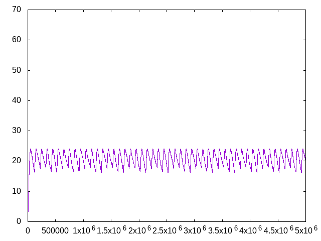
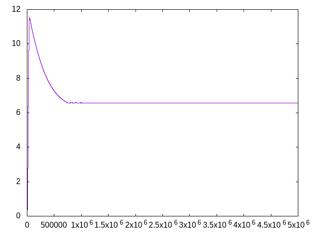
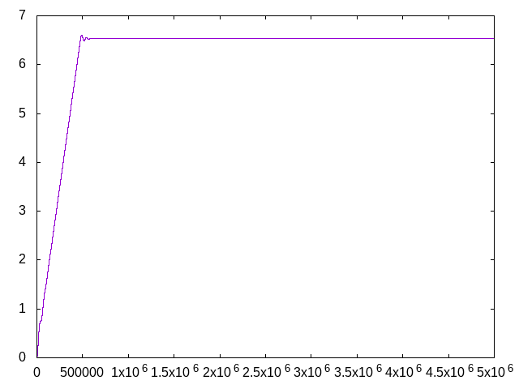
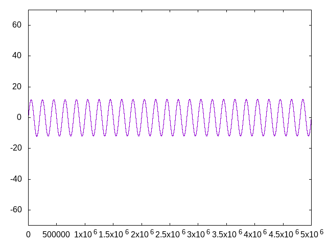
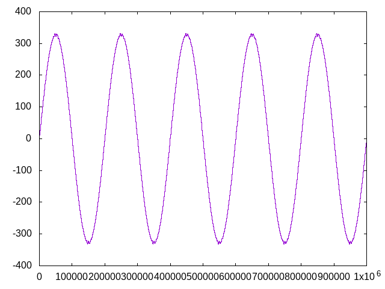
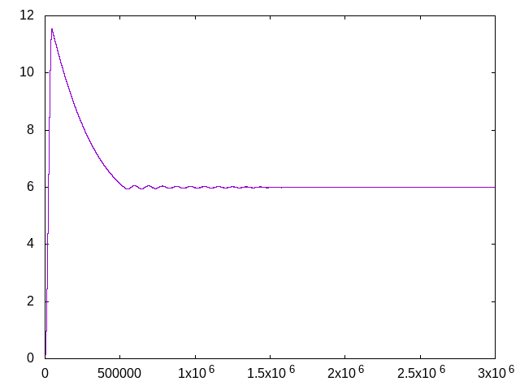
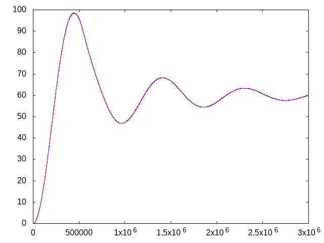

# RLCTrans

RLCTrans is a transient analysis program for circuits where the most important
elements are resistors, inductors and capacitors, and where switches (either
programmatically controlled or automatic diodes) are present. Transformers are
handled by a linear matrix model (potentially multiple transformers per
circuit) or by binary search of the voltages that result in continuous core
magnetic flux (one transformer per circuit only permitted in this case). The
analysis method is nodal analysis (with capacitors, inductors, transformers and
voltage sources converted to current sources with possible shunt resistor). The
program is ideal for analyzing control algorithms and core saturation of
switched mode power supplies and active power factor correction circuits. The
only form of nonlinearities supported are either changing component values from
the C code as the simulation runs (e.g. inductor core saturation by decreasing
inductance from the C code, or modifying load resistance over time to simulate
varying power consumption), diodes and switches. Diode is somewhat idealized:
when it's off there's no leakage, and when it's on there's no voltage drop
apart from the drop caused by its resistance. Threshold voltage may be
simulated by putting a voltage source in series with the diode, but that's
still not the full Shockley diode equation.

MOSFETs may be simulated by a switch and possibly an antiparallel diode if
needed, and BJTs by a switch, a voltage source that provides constant voltage
drop and a diode that prevents reverse current. These models are therefore
rather crude.

The time step in transient analysis is a constant value that isn't changed
dynamically depending on the simulation conditions.

One aspect where RLCTrans totally fails is the determination of efficiency of
switched mode power supplies, because full MOSFET and BJT simulation is not
done, because transformer and inductor core losses are not modeled, and because
the momentary high resistance at switch-on and switch-off times of MOSFETs is
not modeled. Also further contributing to failure is the lack of nonlinear full
Shockley diode simulation.

Partial transformer support is present, but currently the count of transformers
in a circuit is limited to 1 if using the old transformer model. For new
transformer model, multiple transformers per circuit are permitted. However,
even with the old model, the single transformer may have an arbitrary number of
secondary windings, so for example forward converter with a reset winding may
be simulated.

The diode support may in some cases be somewhat unstable, since it may lead to
endless loops where diode switches are opened and closed alternately without
reaching a conclusion. Sometimes this may be solved by adding dummy resistors
with high values, but in the worst situation the solution may be replacement of
diodes with manually controlled switches that are controlled from C code.

Circuits where isolation is present are not supported. So for example you need
to provide a possibly high resistance connection between transformer primary
and secondary so that the voltages on the secondary side would not be floating.

A C code is needed for every simulation, although in most cases it requires
little customization. For switched mode power supplies, of course the full
control algorithm needs to be in the C code.

Because the program is based on nodal analysis, resistance cannot be omitted
for voltage sources, capacitors, switches, diodes and transformers. However,
the resistance can be a small dummy value such as 1 milliohm. Inductors may
not have a built-in resistance, but you may put a second resistor element in
series as the inductor winding resistance.

## Supported component types:

The component name should begin with any of these letters:

* `R` is a resistor (mandatory parameters: `R` for resistance)
* `L` is an inductor (mandatory parameters: `L` for inductance)
* `C` is a capacitor (mandatory parameters: `C` for capacitance, `R` for internal resistance)
* `V` is a voltage source (mandatory parameters: `V` for voltage, `R` for internal resistance)
* `D` is a diode (mandatory parameters: `R` for internal resistance)
* `S` is a switch (mandatory parameters: `R` for internal resistance)
* `T` is a transformer winding using binary search model (mandatory parameters: `N` for turns ratio, `R` for internal resistance, `primary` for flag telling if it's primary winding (1) or secondary winding (0), and for primary windings too: `Lbase` for theoretical inductance if there was only one turn, `Vmin` for minimum search voltage, `Vmax` for maximum search voltage)
* `X` is a transformer winding using linear model (mandatory parameters: `N` for turns ratio, `R` for internal resistance, `primary` for flag telling if it's primary winding (1) or secondary winding (0), and for primary windings too: `Lbase` for theoretical inductance if there was only one turn)

## Some notes about failed simulations

If LU decomposition can't be done, most likely some nodes are isolated or
reachable only via an inductor current source. Adding a high-value resistor
between some nodes helps. This occurs e.g.

* For diode bridges: if all diodes are non-conducting, there is isolation,
  adding some high-value resistors somewhere may help but improperly chosen
  locations for the resistors can lead to recalculation loop
* For transformer circuits: transformers create isolation which needs to be
  broken by adding a high-value resistor from one side of primary to one side
  of secondary
* For circuits where some node is reachable only via an inductor and maybe
  a diode, but if the diode doesn't conduct, it's reachable only via current
  source i.e. the inductor: adding a high-value resistor across the inductor
  helps. Note that adding a high-value resistors across the diode doesn't help,
  since the high-value resistor R will create with the inductor L an RL circuit
  with time constant t=L/R which is extremely small since R is extremely large,
  and the simulation step is too long to simulate this circuit.

If recalculation loop happens, it generally means diodes don't reach a stable
state. It may happen in full wave bridge rectifiers. Adding a high-value
resistor across two diodes may help in this case, but adding only one resistor
or four resistors may cause the recalculation loop again.

In the worst case, if you can't avoid a recalculation loop, you need to replace
diodes with switches that you control from the C code.

## Note about transformers

Transformers with the old model (elements like `T1`) use a binary search and
you need to specify Vmin and Vmax for their primary. The binary search for the
primary voltage is made between these two values. Excessively large spacing
between Vmin and Vmax causes slowness; if the transformer would need to operate
at a point that is not between Vmin and Vmax, simulation fails.

Transformer primary has a parameter Lbase which is defined as: Lbase = L/N^2,
where L is the inductance of the primary winding and N is the count of wire
loops in the primary winding.

Transformers with the old model are currently limited to max 1 transformer per
circuit, but the transformer may have an unlimited number of secondary
windings. Secondary windings may not have Lbase, Vmin or Vmax; they are derived
automatically from the wire loop count N which must be present for all
transformer windings.

New model (elements like `X1`) does not have these restrictions, but results
sometimes in recalculation loop if multiple diodes in the circuit are present,
due to numerical inaccuracy. You may need to add a high-value bypass resistor
across some diode to prevent this recalculation loop. The new linear matrix
based transformer model is much faster.

## Note about OpenBLAS

Note that some versions of OpenBLAS require the environment variable:

```
export OPENBLAS_NUM_THREADS=1
```

...to work fast. Recent versions of OpenBLAS, however, automatically use only
one thread if the matrix is small, which it usually is.

Note that since transformers are handled by a binary search, the moment a
transformer is added to a circuit reduces performance markedly.

## How to build

RLCTrans is built using stirmake. How to build: first install byacc and flex.
Then install stirmake:

```
git clone https://github.com/Aalto5G/stirmake
cd stirmake
git submodule init
git submodule update
cd stirc
make
./install.sh
```

This installs stirmake to `~/.local`. If you want to install to `/usr/local`,
run `./install.sh` by typing `sudo ./install.sh /usr/local` (and you may want
to run `sudo mandb` also).

If the installation told `~/.local` is missing, create it with `mkdir` and try
again. If the installation needed to create `~/.local/bin`, you may need to
re-login for the programs to appear in your `PATH`.

Then ensure that some version of lapack along with its development headers is
installed and build RLCTrans by:

```
cd rlctrans
smka
```

## Examples

### Full-wave bridge rectifier

Netlist rectifier.txt:

```
1 0 V1 V=0 R=1e-3
1 2 D1 R=1e-3
1 2 R1 R=1e10
0 2 D2 R=1e-3
3 1 D3 R=1e-3
3 1 R3 R=1e10
3 0 D4 R=1e-3
2 3 C1 C=2200e-6 R=1e-3 Vinit=0
2 3 RL R=10
```

Note the resistors R1 and R3 that have a large value and are in parallel with
diodes D1 and D3. The resistors with large value are needed to avoid isolation
if no diode is conducting, and to create asymmetry which prevents infinite
recalculation loops.

Main program which modifies value of `RL` dynamically:

```
#include <stdio.h>
#include <math.h>
#include "libsimul.h"

const double dt = 1e-7; // 100 ns

int main(int argc, char **argv)
{
	size_t i;
	double t = 0.0;
	struct libsimul_ctx ctx;
	linsimul_init(&ctx, dt);
	read_file(&ctx, "rectifier.txt");
	init_simulation(&ctx);
	for (i = 0; i < 5*1000*1000; i++)
	{
		set_voltage_source(&ctx, "V1", 24.0*sin(2*3.14159265358979*50.0*t));
		if (set_resistor(&ctx, "RL", 10.0*(1+0.3*sin(2*3.14159265358979*75.0*t))) != 0)
		{
			recalc(&ctx);
		}
		t += dt;
		simulation_step(&ctx);
		printf("%zu %g\n", i, get_V(&ctx, 2)-get_V(&ctx, 3));
	}
	return 0;
}
```

Plot of output:



### Buck converter controlled by constant 50% duty cycle:

Netlist buck.txt:

```
1 0 V1 V=13.2 R=1e-3
1 2 S1 R=1e-3
0 2 D1 R=1e-3
2 3 RRL1 R=1e9
2 3 L1 L=300e-6 Iinit=0
3 4 RL1 R=30.6e-3
4 0 C1 C=6600e-6 R=1e-3 Vinit=0
4 0 RL R=10
```

Note the resistor RRL1 with large value in parallel with L1. It is needed to
avoid isolating the end of L1 which is connected to the rest only via an
inductor that is essentially a constant current source whenever D1 is not
conducting and S1 is open.

Main program:

```
#include <stdio.h>
#include "libsimul.h"

const double dt = 1e-7; // 100 ns

int main(int argc, char **argv)
{
	size_t i;
	int switch_state = 1;
	int cnt_remain = 500;
	struct libsimul_ctx ctx;
	linsimul_init(&ctx, dt);
	read_file(&ctx, "buck.txt");
	init_simulation(&ctx);
	if (set_switch_state(&ctx, "S1", switch_state) != 0)
	{
		recalc(&ctx);
	}
	for (i = 0; i < 5*1000*1000; i++)
	{
		simulation_step(&ctx);
		printf("%zu %g\n", i, get_V(&ctx, 4));
		cnt_remain--;
		if (cnt_remain == 0)
		{
			switch_state = !switch_state;
			if (set_switch_state(&ctx, "S1", switch_state) != 0)
			{
				recalc(&ctx);
			}
			if (switch_state)
			{
				cnt_remain = 500;
			}
			else
			{
				cnt_remain = 500;
			}
		}
	}
	return 0;
}
```

Because of the constant duty cycle, there is significant overshoot in powering
up the buck converter. A more sophisticated control algorithm could avoid the
overshoot.

Plot of output:



### Better ramp-up of buck converter

If we modify the netlist to have more resistance and different component
values:

```
1 0 V1 V=13.2 R=1e-3
1 2 S1 R=1e-3
0 2 D1 R=1e-3
2 3 RRL1 R=1e9
2 3 L1 L=300e-6 Iinit=0
3 4 RL1 R=100e-3
4 0 C1 C=2200e-6 R=1e-3 Vinit=0
4 0 RL R=10
```

Note the resistor RRL1 with large value in parallel with L1. It is needed to
avoid isolating the end of L1 which is connected to the rest only via an
inductor that is essentially a constant current source whenever D1 is not
conducting and S1 is open.

...and have slow ramp-up in the control algorithm:

```
#include <stdio.h>
#include "libsimul.h"

const double dt = 1e-7; // 100 ns
double duty_cycle = 0.02;

void recalc_dc(void)
{
	double new_dc;
	new_dc = duty_cycle+0.0001;
	if (new_dc > 0.5)
	{
		new_dc = 0.5;
	}
	duty_cycle = new_dc;
}

int main(int argc, char **argv)
{
	size_t i;
	int switch_state = 1;
	int cnt_remain = 100*duty_cycle;
	struct libsimul_ctx ctx;
	linsimul_init(&ctx, dt);
	read_file(&ctx, "buckramp.txt");
	init_simulation(&ctx);
	if (set_switch_state(&ctx, "S1", switch_state) != 0)
	{
		recalc_dc();
		cnt_remain = 100*duty_cycle;
	}
	for (i = 0; i < 5*1000*1000; i++)
	{
		simulation_step(&ctx);
		printf("%zu %g\n", i, get_V(&ctx, 4));
		cnt_remain--;
		if (cnt_remain == 0)
		{
			switch_state = !switch_state;
			if (set_switch_state(&ctx, "S1", switch_state) != 0)
			{
				recalc(&ctx);
			}
			if (switch_state)
			{
				recalc_dc();
				cnt_remain = 100*duty_cycle;
			}
			else
			{
				cnt_remain = 100*(1-duty_cycle);
			}
		}
	}
	return 0;
}
```

...it is possible to avoid the overshoot:



### AC transformer

Netlist transformer.txt:

```
1 0 V1 V=0 R=1e-3
1 0 T1 N=100 primary=1 Lbase=1e-6 Vmin=-30 Vmax=30 R=60e-3
0 2 Rbypass R=1e10
3 2 T1 N=50 primary=0 R=60e-3
3 2 RL R=10
```

Alternative netlist for newer fast transformer model:

```
1 0 V1 V=0 R=1e-3
1 0 X1 N=100 primary=1 Lbase=1e-6 Vmin=-30 Vmax=30 R=60e-3
0 2 Rbypass R=1e10
3 2 X1 N=50 primary=0 R=60e-3
3 2 RL R=10
```

Note the bypass resistor Rbypass with large value. It is needed to avoid
isolating the output of transformer from the input, which would create a
situation that voltage between input and output would not be defined.

Main program:

```
#include <stdio.h>
#include <math.h>
#include "libsimul.h"

const double dt = 1e-7; // 100 ns

int main(int argc, char **argv)
{
	size_t i;
	double t = 0.0;
	struct libsimul_ctx ctx;
	linsimul_init(&ctx, dt);
	read_file(&ctx, "transformer.txt");
	init_simulation(&ctx);
	for (i = 0; i < 5*1000*1000; i++)
	{
		set_voltage_source(&ctx, "V1", 24.0*sin(2*3.14159265358979*50.0*t));
		t += dt;
		simulation_step(&ctx);
		printf("%zu %g\n", i, get_V(&ctx, 3) - get_V(&ctx, 2));
	}
	return 0;
}
```

Plot of output:



### True sine wave inverter

Netlist inverterpwm.txt:

```
1 0 V1 V=400 R=1e-3
1 2 S1 R=1e-3
1 3 S3 R=1e-3
0 2 S4 R=1e-3
0 3 S2 R=1e-3
2 4 L1 L=1020e-6 Iinit=0
4 5 R1 R=0.17745
5 3 C1 C=7.5e-6 R=1e-3
5 3 RL R=100
```

Program to control it:

```
#include <stdio.h>
#include <math.h>
#include "libsimul.h"

const double dt = 1e-7; // 100 ns

void set_switches(struct libsimul_ctx *ctx, int onoff)
{
	if (onoff)
	{
		set_switch_state(ctx, "S1", 1);
		set_switch_state(ctx, "S2", 1);
		set_switch_state(ctx, "S3", 0);
		set_switch_state(ctx, "S4", 0);
	}
	else
	{
		set_switch_state(ctx, "S1", 0);
		set_switch_state(ctx, "S2", 0);
		set_switch_state(ctx, "S3", 1);
		set_switch_state(ctx, "S4", 1);
	}
	recalc(ctx);
}

int main(int argc, char **argv)
{
	size_t i;
	int cnt_remain = 500;
	const double f = 50;
	const double switch_f = 100e3;
	double curduty;
	const double V_in = 400;
	const double V_sine = 325.27;
	const double pi = 3.14159265358979;
	double t = 0;
	double ontime = 1e-5, offtime = 1e-5, V_out_ideal;
	int onoff = 0;
	struct libsimul_ctx ctx;
	linsimul_init(&ctx, dt);
	read_file(&ctx, "inverterpwm.txt");
	init_simulation(&ctx);
	set_switches(&ctx, 1);
	cnt_remain = 1;
	for (i = 0; i < 1000*1000; i++)
	{
		simulation_step(&ctx);
		t += dt;
		printf("%zu %g\n", i, get_V(&ctx, 5)-get_V(&ctx, 3));
		cnt_remain--;
		if (cnt_remain == 0 && onoff == 1)
		{
			set_switches(&tx, 0);
			cnt_remain = offtime/dt;
			onoff = 0;
		}
		if (cnt_remain == 0 && onoff == 0)
		{
			V_out_ideal = V_sine*sin(2*pi*f*t);
			V_out_ideal += V_sine*sin(2*pi*f*(t+1/70e3));
			V_out_ideal /= 2;
			curduty = 1.0 - (V_in - V_out_ideal)/(2*V_in);
			ontime = curduty/switch_f;
			offtime = (1.0-curduty)/switch_f;
			cnt_remain = ontime/dt;
			set_switches(&ctx, 1);
			onoff = 1;
		}
	}
	return 0;
}
```

Plot of output:



### Forward converter

Netlist forward.txt:

```
1 0 VS V=24 R=1e-3
1 2 T1 N=100 primary=1 Lbase=5e-7 Vmin=-100 Vmax=100 R=6e-3
3 1 T1 N=120 primary=0 R=12e-3
2 0 S1 R=1e-3
0 3 D3 R=1e-3
5 4 T1 N=50 primary=0 R=3e-3
0 4 Rbypass R=1e10
5 6 D1 R=1e-3
4 6 D2 R=1e-3
6 7 RRL1 R=1e10
6 7 L1 L=1e-3
7 8 RL1 R=10e-3
8 4 C1 C=2200e-6 R=1e-3
8 4 RL R=24
```

Alternative netlist for newer linear fast transformer model:

```
1 0 VS V=24 R=1e-3
1 2 X1 N=100 primary=1 Lbase=5e-7 R=6e-3
3 1 X1 N=120 primary=0 R=12e-3
2 0 S1 R=1e-3
0 3 D3 R=1e-3
0 3 RRD3 R=1e10
5 4 X1 N=50 primary=0 R=3e-3
0 4 Rbypass R=1e10
5 6 D1 R=1e-3
4 6 D2 R=1e-3
6 7 RRL1 R=1e10
6 7 L1 L=1e-3
7 8 RL1 R=10e-3
8 4 C1 C=2200e-6 R=1e-3
8 4 RL R=24
```

Note the RRL1 which prevents isolation of node 6 and Rbypass which prevents
isolation of transformer primary and secondary sides. Note also the RRD3 which
is needed for the new transformer model to prevent recalculation loop.

Program to control it:

```
#include <stdio.h>
#include "libsimul.h"

const double dt = 1e-7; // 100 ns

int main(int argc, char **argv)
{
	size_t i;
	int switch_state = 1;
	int cnt_remain = 500;
	struct libsimul_ctx ctx;
	libsimul_init(&ctx, dt);
	read_file(&ctx, "forward.txt");
	init_simulation(&ctx);
	if (set_switch_state(&ctx, "S1", switch_state) != 0)
	{
		recalc(&ctx);
	}
	for (i = 0; i < 3*1000*1000; i++)
	{
		simulation_step(&ctx);
		printf("%zu %g\n", i, get_V(&ctx, 7) - get_V(&ctx, 4));
		cnt_remain--;
		if (cnt_remain == 0)
		{
			switch_state = !switch_state;
			if (set_switch_state(&ctx, "S1", switch_state) != 0)
			{
				recalc(&ctx);
			}
			if (switch_state)
			{
				cnt_remain = 500;
			}
			else
			{
				cnt_remain = 500;
			}
		}
	}
	libsimul_free(&ctx);
	return 0;
}
```

Plot of output:



Note that similar to buck converter with same control algorithm, the forward
converter has massive overshoot.

### Flyback converter

Netlist flyback.txt:

```
1 0 VS V=24 R=1e-3
1 2 T1 N=100 primary=1 Lbase=1e-6 Vmin=-5000 Vmax=5000 R=6e-3
2 0 S1 R=1e-3
2 0 RRS1 R=1e10
3 4 T1 N=50 primary=0 R=3e-3
0 3 Rbypass R=1e10
4 5 D1 R=1e-3
5 3 C1 C=2200e-6 R=1e-3
5 3 RL R=24
```

Alternative netlist for newer fast transformer model:

```
1 0 VS V=24 R=1e-3
1 2 X1 N=100 primary=1 Lbase=1e-6 R=6e-3
2 0 S1 R=1e-3
3 4 X1 N=50 primary=0 R=3e-3
0 3 Rbypass R=1e10
4 5 D1 R=1e-3
5 3 C1 C=2200e-6 R=1e-3
5 3 RL R=24
```

Note the Rbypass which prevents isolation of transformer primary and secondary
sides. Note also RRS1 for bypassing the switch which is needed for the old
transformer model.

Program to control it:

```
#include <stdio.h>
#include "libsimul.h"

const double dt = 1e-7; // 100 ns

int main(int argc, char **argv)
{
	size_t i;
	int switch_state = 1;
	int cnt_remain = 500;
	struct libsimul_ctx ctx;
	libsimul_init(&ctx, dt);
	read_file(&ctx, "flyback.txt");
	init_simulation(&ctx);
	if (set_switch_state(&ctx, "S1", switch_state) != 0)
	{
		set_diode_hint(&ctx, "D1", !switch_state);
		recalc(&ctx);
	}
	for (i = 0; i < 3*1000*1000; i++)
	{
		simulation_step(&ctx);
		printf("%zu %g\n", i, get_V(&ctx, 5) - get_V(&ctx, 3));
		cnt_remain--;
		if (cnt_remain == 0)
		{
			switch_state = !switch_state;
			if (set_switch_state(&ctx, "S1", switch_state) != 0)
			{
				set_diode_hint(&ctx, "D1", !switch_state);
				recalc(&ctx);
			}
			if (switch_state)
			{
				cnt_remain = 500;
			}
			else
			{
				cnt_remain = 100;
			}
		}
	}
	libsimul_free(&ctx);
	return 0;
}
```

Plot of output:



Note the massive overshoot and slow oscillation. Note also the major increase
from input voltage: flyback converters can be used to create very high voltages
if needed.

## License

All of the material related to RLCTrans is licensed under the following MIT
license:

Copyright (c) 2023 Juha-Matti Tilli

Permission is hereby granted, free of charge, to any person obtaining a copy of
this software and associated documentation files (the "Software"), to deal in
the Software without restriction, including without limitation the rights to
use, copy, modify, merge, publish, distribute, sublicense, and/or sell copies
of the Software, and to permit persons to whom the Software is furnished to do
so, subject to the following conditions:

The above copyright notice and this permission notice shall be included in all
copies or substantial portions of the Software.

THE SOFTWARE IS PROVIDED "AS IS", WITHOUT WARRANTY OF ANY KIND, EXPRESS OR
IMPLIED, INCLUDING BUT NOT LIMITED TO THE WARRANTIES OF MERCHANTABILITY,
FITNESS FOR A PARTICULAR PURPOSE AND NONINFRINGEMENT. IN NO EVENT SHALL THE
AUTHORS OR COPYRIGHT HOLDERS BE LIABLE FOR ANY CLAIM, DAMAGES OR OTHER
LIABILITY, WHETHER IN AN ACTION OF CONTRACT, TORT OR OTHERWISE, ARISING FROM,
OUT OF OR IN CONNECTION WITH THE SOFTWARE OR THE USE OR OTHER DEALINGS IN THE
SOFTWARE.
